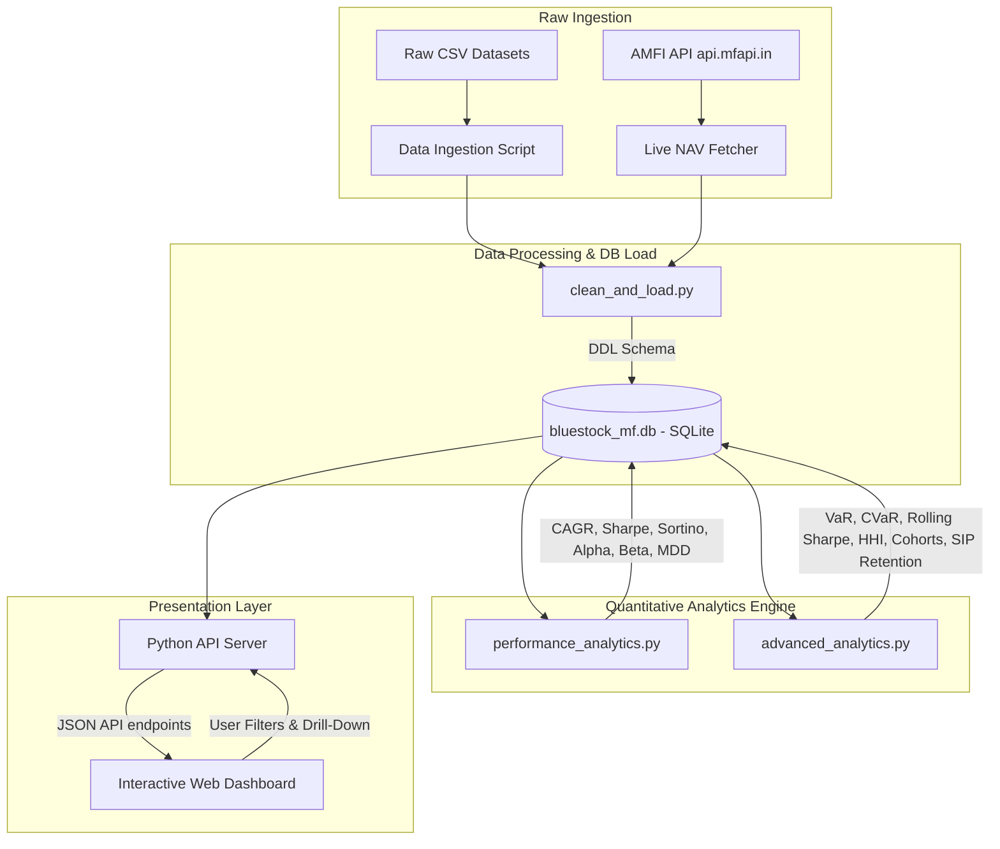
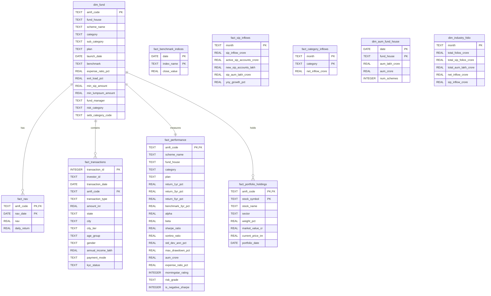

# Mutual Fund Analytics Capstone Project

An end-to-end data engineering, quantitative analytics, and interactive dashboard pipeline for the Indian Mutual Fund industry. 

This project simulates a real-world enterprise analytics system—ingesting raw data from multiple formats, cleaning and loading it into a relational SQLite database via a star schema, running a quantitative performance engine, calculating advanced risk and retention metrics, and serving an interactive web dashboard.

---

## 🏗️ System Architecture

The following diagram illustrates the flow of data from raw ingestion to the end-user dashboard:



---

## 🛠️ Technology Stack

* **Programming Language**: Python 3.x
* **Data Processing & Calculations**: Pandas, NumPy, SciPy
* **Visualization & Reports**: Matplotlib, Seaborn
* **Database**: SQLite3, SQLAlchemy
* **Frontend Dashboard**: HTML5, CSS3, Javascript, Chart.js, Font Awesome
* **Backend API Server**: Python `http.server` & `socketserver`

---

## 🗄️ Database Design (Star Schema)

The database schema is structured as a dimensional model designed for rapid analytical queries:



---

## 📈 Quantitative Analytics & Risk Formulas

The analytics engine calculates several industry-standard metrics:

### 1. Daily Return
Calculates day-on-day price movements:
$$Return_t = \frac{NAV_t - NAV_{t-1}}{NAV_{t-1}}$$

### 2. CAGR (Compounded Annual Growth Rate)
Measures annualized investment growth over NAV history:
$$CAGR = \left(\frac{Ending\ Value}{Beginning\ Value}\right)^{\frac{365.25}{Days}} - 1$$

### 3. Sharpe Ratio
Measures risk-adjusted performance using a 6.0% risk-free rate ($R_f$):
$$Sharpe = \frac{R_p - R_f}{\sigma_p}$$

### 4. Sortino Ratio
Penalizes downside volatility (where $R_{p,t} < R_{f, \text{daily}}$) rather than total volatility:
$$Sortino = \frac{R_p - R_f}{\sigma_{\text{downside}}}$$

### 5. Beta ($\beta$)
Measures fund price volatility relative to its benchmark index:
$$\beta = \frac{Cov(R_p, R_m)}{Var(R_m)}$$

### 6. CAPM Alpha ($\alpha$)
Measures the value added by the fund manager relative to market risk:
$$\alpha = R_p - [R_f + \beta \times (R_m - R_f)]$$

### 7. Maximum Drawdown (MDD)
Measures the largest peak-to-trough drop in NAV:
$$Drawdown_t = \frac{NAV_t - Peak_t}{Peak_t}$$
$$MDD = \min(Drawdown_t)$$

### 8. Value at Risk (VaR) & Conditional VaR (CVaR)
* **95% Daily VaR**: The 5th percentile of daily return history (worst expected loss on 95% of days).
* **95% Daily CVaR**: The average loss on days when returns fell below the VaR threshold.

### 9. Herfindahl-Hirschman Index (HHI)
Measures stock portfolio diversification based on sector weights ($w_i$):
$$HHI = \sum w_i^2$$
* **HHI < 1500**: Diversified
* **HHI 1500–2500**: Moderately Concentrated
* **HHI > 2500**: Highly Concentrated

---

## 💻 Running the Pipeline & Web App

### 1. Ingest Data
Fetch live NAVs and perform raw data quality checks:
```bash
python live_nav_fetch.py
python data_ingestion.py
```

### 2. Clean & Load
Clean datasets, create database tables, and run load routines:
```bash
python clean_and_load.py
```

### 3. Run Analytics
Execute quantitative performance models, advanced risk algorithms, and SQL analytical reports:
```bash
python scripts/performance_analytics.py
python scripts/advanced_analytics.py
python run_queries.py
```

### 4. Run Verification Checks
Ensure all database row counts, data validation rules, and mathematical bounds are correct:
```bash
python verify_pipeline.py
python scripts/verify_analytics.py
```

### 5. Launch Interactive Dashboard
Run the dashboard backend API server:
```bash
python dashboard/server.py
```
Open your browser at **[http://localhost:8050](http://localhost:8050)** to view the web dashboard.

---

## 🖥️ Dashboard Page Features

* **Page 1: Industry Overview**: Renders global KPIs (Total AUM, SIP Inflows, Folios, Monitored Schemes) and visualizes monthly inflows and folio growth trends.
* **Page 2: Fund Performance Scorecard**: Renders a Risk-Return scatter matrix, lowest expense ratios, and a searchable scorecard table ranked by composite performance scores.
* **Page 3: Drill-Through Analytics**: Clicking **Analytics** in the scorecard table opens a drill-through window showing a dual-axis historical NAV vs. 90-day rolling Sharpe graph, risk metrics, and top stock holdings.
* **Page 4: Investor Demographics**: Illustrates investor profiles across age cohorts, genders, geographic states, and digital payment methods.
* **Page 5: Advanced Risk & Cohorts**: Renders a cohort retention matrix heatmap, SIP continuation status (Active vs. At Risk), portfolio HHI concentration, and critical accounts flagged for retention.
* **Page 6: Recommendation Engine**: Recommends the top 3 mutual funds matching Low, Moderate, or High risk tolerances.
