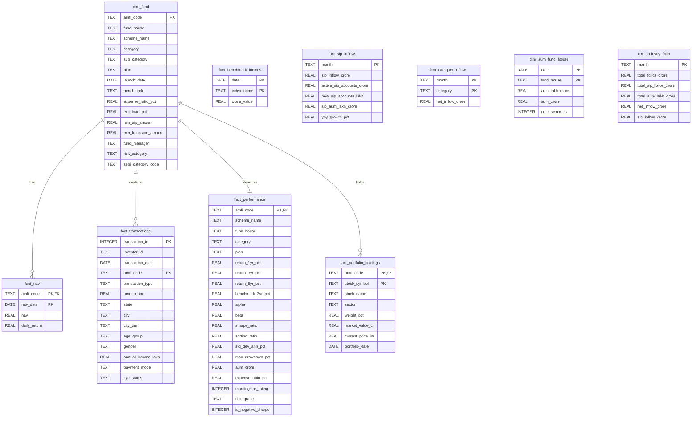

# Implementation Plan - Mutual Fund Analytics Day 2

This plan outlines the objectives, design decisions, database schema, and verification steps for Day 2 of the Mutual Fund Analytics Capstone Project.

## User Review Required

> [!NOTE]
> The raw datasets contain 1,150 unique dates in `02_nav_history.csv` which corresponds exactly to the 1,150 Monday-through-Friday business days between `2022-01-03` and `2026-05-29`. The "Forward-fill missing NAV (holidays)" requirement will be handled by reindexing each mutual fund scheme's NAV time series to the full business days frequency (`freq='B'`) and forward-filling the NAV, ensuring we preserve the exact 46,000 rows.

> [!IMPORTANT]
> The prompt mentions "6-10: (see notebook)" for the SQL queries, but the `notebooks` directory is empty. We have designed 5 highly relevant and analytical mutual fund queries (covering sector allocations, demographic analyses, risk-adjusted performance, and payment mode analysis) to fulfill queries 6-10.

## Proposed Changes

### Data Cleaning and Processing Scripts

We will implement a Python script [clean_and_load.py](file:///e:/BlueStock%20Intern%20Project/Mutual%20Fund%20Analytics/clean_and_load.py) that will clean all 10 datasets, create the SQLite database, define the schema, and load the cleaned data.

#### [NEW] [clean_and_load.py](file:///e:/BlueStock%20Intern%20Project/Mutual%20Fund%20Analytics/clean_and_load.py)
This script will:
- Load the 10 raw datasets from `data/raw/`.
- Clean each dataset programmatically:
  1. `01_fund_master.csv` -> Standardize string fields, validate launched dates.
  2. `02_nav_history.csv` -> Parse dates, sort by `amfi_code` + `date`, reindex to standard business days, calculate `daily_return` as pct_change, forward-fill missing NAVs, and validate NAV > 0.
  3. `03_aum_by_fund_house.csv` -> Clean string columns and validate numeric values.
  4. `04_monthly_sip_inflows.csv` -> Parse `month` (e.g. `YYYY-MM`), keep `yoy_growth_pct` as float (with expected first-year nulls due to no 2021 data).
  5. `05_category_inflows.csv` -> Clean strings and validate numbers.
  6. `06_industry_folio_count.csv` -> Clean strings and validate numbers.
  7. `07_scheme_performance.csv` -> Validate returns are numeric, create `is_negative_sharpe` flag, and check that `expense_ratio` lies within standard `[0.1%, 2.5%]`.
  8. `08_investor_transactions.csv` -> Standardize `transaction_type` (SIP/Lumpsum/Redemption), validate amount > 0, validate KYC values (Verified/Pending), and fix date formats.
  9. `09_portfolio_holdings.csv` -> Clean sector/stock names, ensure numeric weights and prices.
  10. `10_benchmark_indices.csv` -> Parse index closing values and dates.
- Save cleaned CSVs to `data/processed/` with `clean_` prefix.
- Initialize `bluestock_mf.db` and establish the 10-table relational schema with strict data types, Primary Keys, and Foreign Key constraints.
- Load the data into the database using SQLAlchemy.

### Database Schema Design

We will define the SQLite schema in [sql/schema.sql](file:///e:/BlueStock%20Intern%20Project/Mutual%20Fund%20Analytics/sql/schema.sql) with the following relational tables:

### SQL Queries for Analysis

We will define and execute the 10 SQL queries in [sql/queries.sql](file:///e:/BlueStock%20Intern%20Project/Mutual%20Fund%20Analytics/sql/queries.sql):
1. **Top 5 funds by AUM**
2. **Average NAV per month** (by fund)
3. **SIP inflow YoY growth** (calculated & verified)
4. **Transactions by state** (volume & value)
5. **Funds with expense_ratio < 1%**
6. **Top 5 sectors by total allocation**
7. **Demographic analysis of transactions** (by age group & gender)
8. **Benchmark performance comparison** (average returns by benchmark)
9. **Top performing fund (3yr return) by risk category**
10. **Transaction volume/value by payment mode and city tier**

### Data Dictionary

We will create a comprehensive data dictionary in [data_dictionary.md](file:///e:/BlueStock%20Intern%20Project/Mutual%20Fund%20Analytics/data_dictionary.md) documenting every column name, type, source table, and description.

## Verification Plan

### Automated Verification
We will write and run a test script [verify_pipeline.py](file:///e:/BlueStock%20Intern%20Project/Mutual%20Fund%20Analytics/verify_pipeline.py) to:
- Verify that 10 cleaned CSV files exist in `data/processed/` and contain the correct number of rows and columns.
- Query `bluestock_mf.db` to check that the tables were created successfully and data loaded.
- Run all 10 SQL queries and format the results into [sql/queries.sql](file:///e:/BlueStock%20Intern%20Project/Mutual%20Fund%20Analytics/sql/queries.sql).
- Verify constraints (e.g. transaction amounts > 0, NAV values > 0, expense ratios in correct ranges).

### Manual Verification
- Inspect the generated database and files using SQLite CLI or python commands.
