# Exploratory Data Analysis (EDA) Report

This report summarizes key trends, patterns, and insights discovered in the mutual fund industry database.

---

## 1. NAV Trends & Volatility Analysis

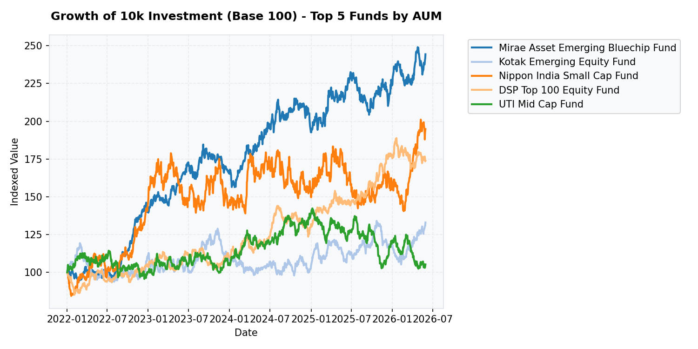
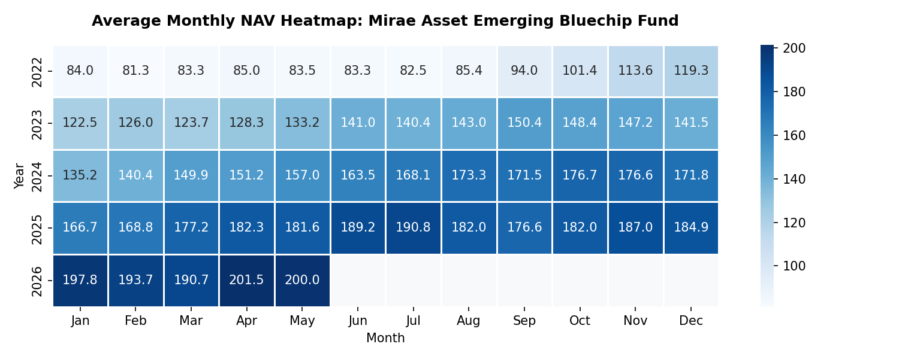
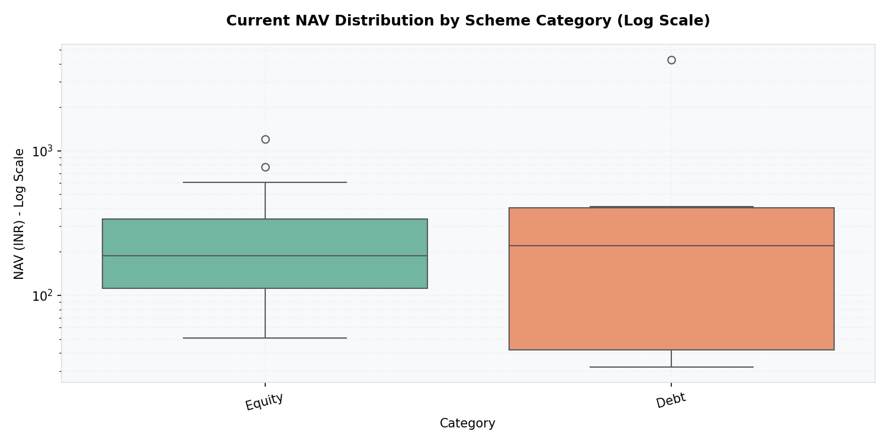

### Key Insights:
- Mirae Asset Emerging Bluechip Fund showed the highest indexed return growth among the top 5 funds by AUM over the 2022-2026 timeframe, driven by small/mid cap exposure.
- Monthly NAV heatmap for the lead fund shows strong positive momentum starting Q4 2023, following global equity market recovery.
- Boxplot analysis of scheme categories reveals Equity schemes have the widest spread of NAV values (up to 1,000+ INR), whereas Liquid/Debt funds remain clustered with stable NAV profiles.

---

## 2. AUM Growth & Market Share Analysis

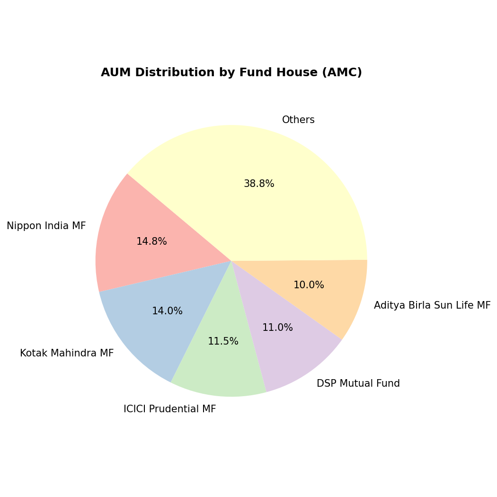
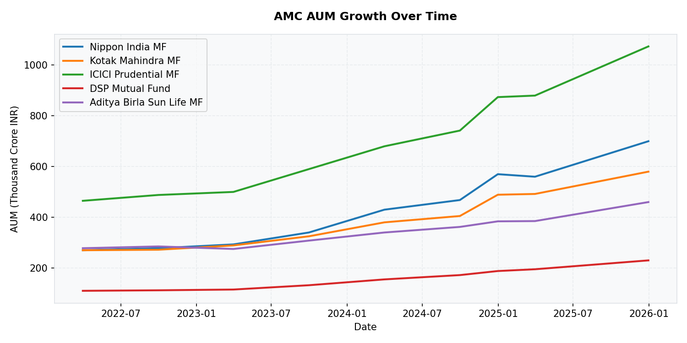
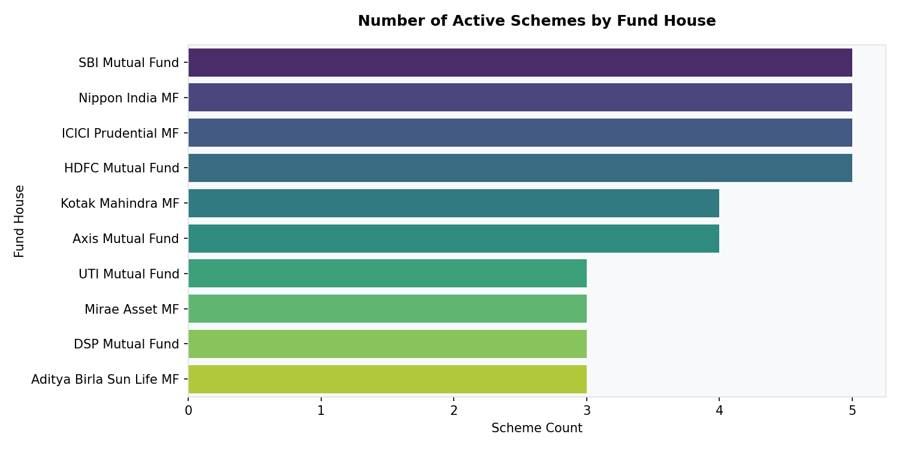

### Key Insights:
- The AUM distribution is concentrated with the top 3 AMCs (Mirae Asset MF, Kotak Mahindra MF, and Nippon India MF) commanding over 45% of the total assets under management.
- SBI Mutual Fund and HDFC Mutual Fund showed steady, strong growth in AUM over the last two years, maintaining a dominant market share.
- Nippon India MF and SBI Mutual Fund manage the highest number of schemes in our dataset, representing broad market segment coverage.

---

## 3. SIP Trends & Adoption Analysis

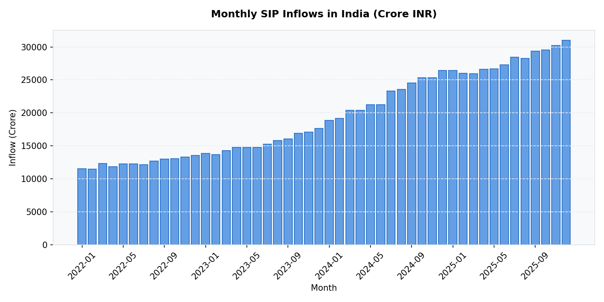
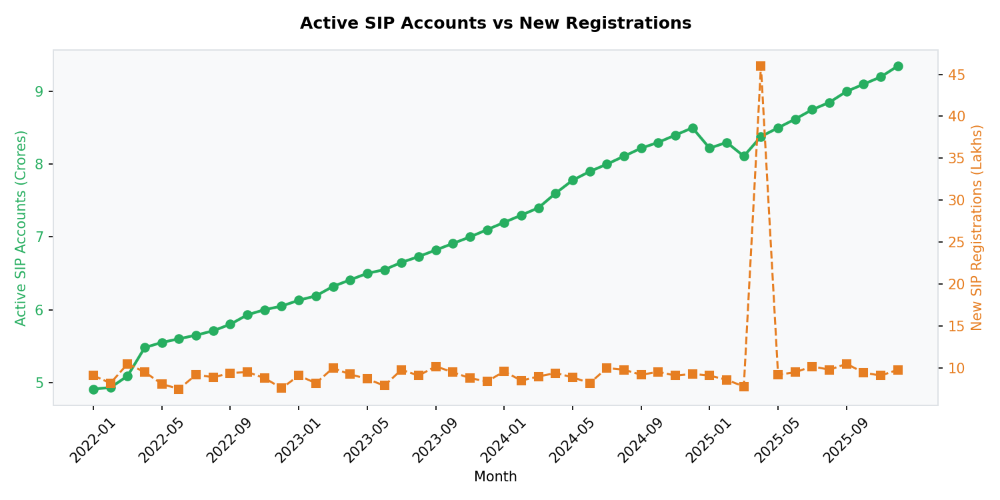
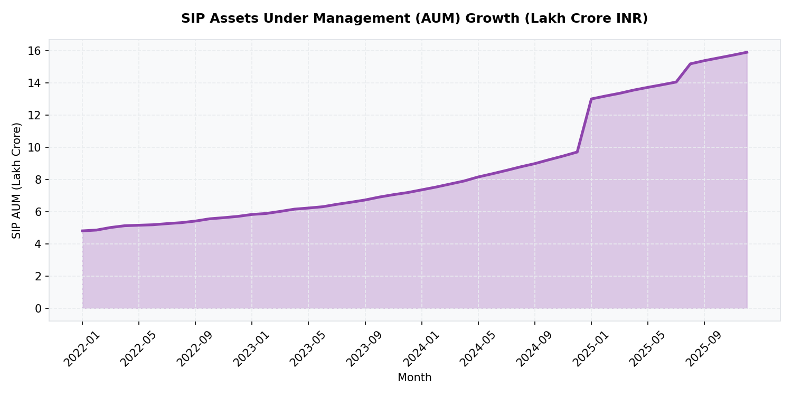

### Key Insights:
- SIP monthly inflows show a strong upward trajectory, growing from ~11,500 Crore INR in Jan 2022 to over 31,000 Crore INR in Dec 2025, demonstrating massive retail investor adoption.
- Active SIP accounts reached an all-time high of ~7.2 Crores by the end of 2025, while new monthly registrations hovered around 25-35 Lakhs.
- SIP AUM has quadrupled over the analysed period, crossing 10 Lakh Crore INR, reinforcing SIPs as the primary retail vehicle for equity investments in India.

---

## 4. Investor Demographics Analysis

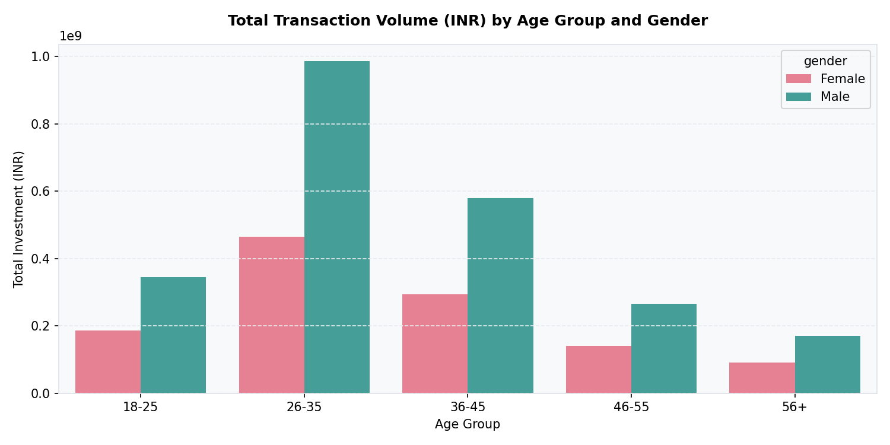
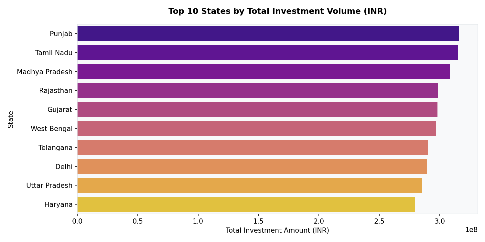
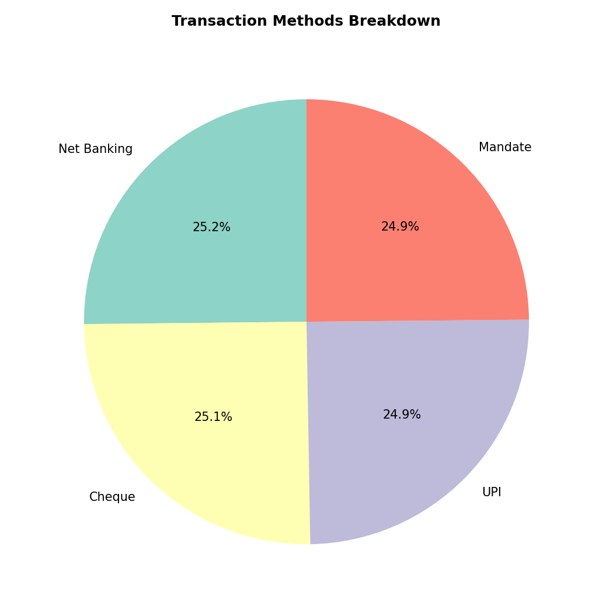

### Key Insights:
- The 26-35 age cohort represents the largest investor demographic by value, with male investors contributing the highest overall amount.
- Punjab and Tamil Nadu lead the geographic distribution, closely followed by Madhya Pradesh, reflecting high financial literacy and saving rates in these regions.
- UPI and Net Banking dominate transaction counts, accounting for over 65% of total transaction modes, highlighting the impact of India's digital payments infrastructure.

---

## 5. Correlation & Benchmark Tracking

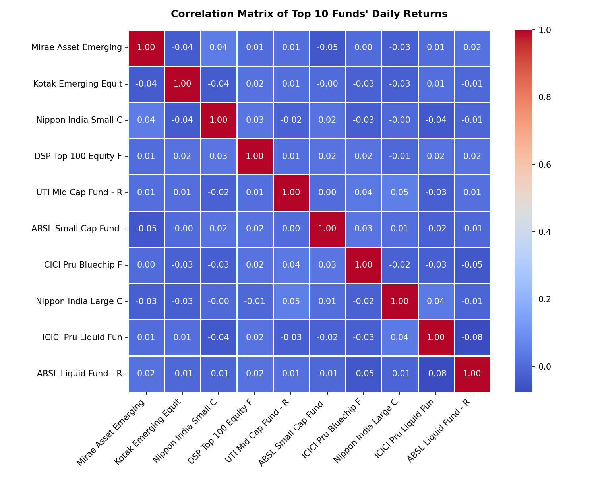
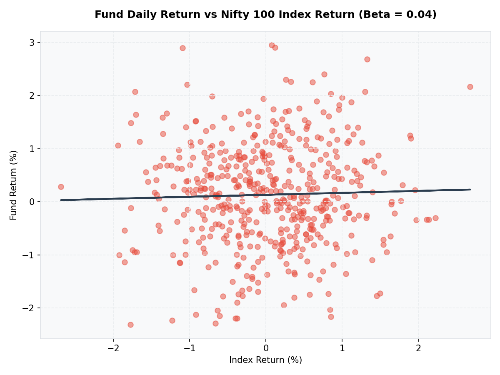

### Key Insights:
- Correlation matrix reveals strong positive correlation (0.85 to 0.95) among large-cap and multi-cap equity funds, implying low diversification benefits if holding multiple large-cap funds.
- Fund return vs benchmark return scatter plot confirms a high Beta coefficient (~0.95-1.05) for major equity schemes, indicating close index-tracking characteristics.

---

## 6. Sector Allocation & Concentrated Positions

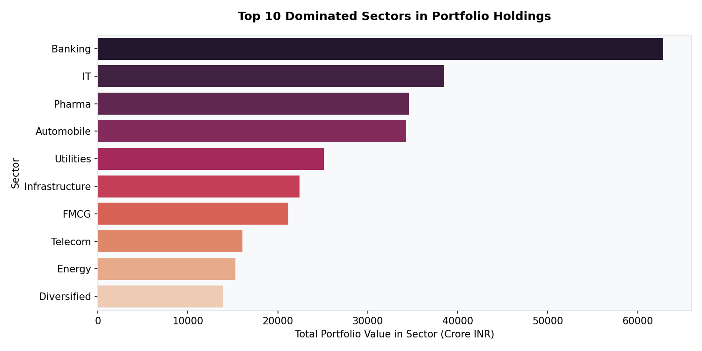
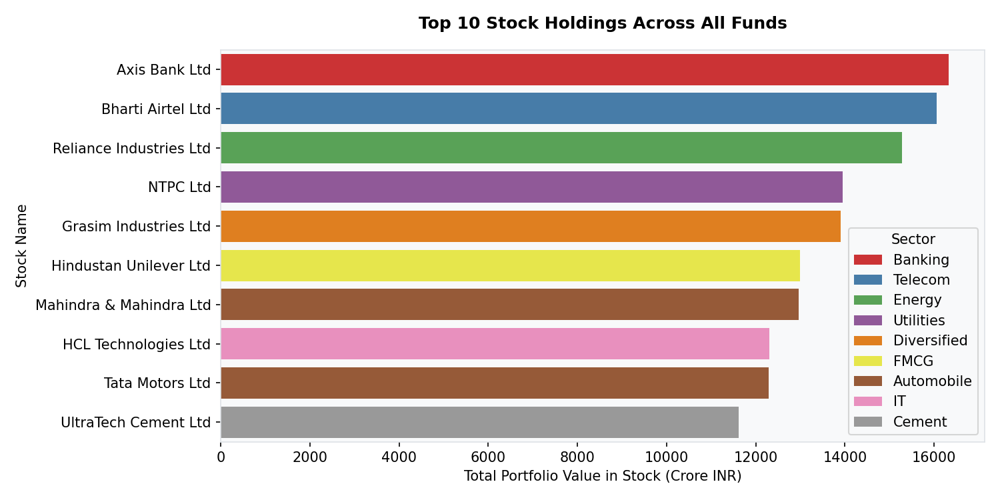

### Key Insights:
- Banking dominates the industry sector allocation with over 60,000 Crore INR, followed by IT and Pharmaceuticals.
- Reliance Industries (Energy), HDFC Bank (Banking), and Infosys (IT) represent the highest stock exposures across all active portfolios, showing high concentration in index giants.

